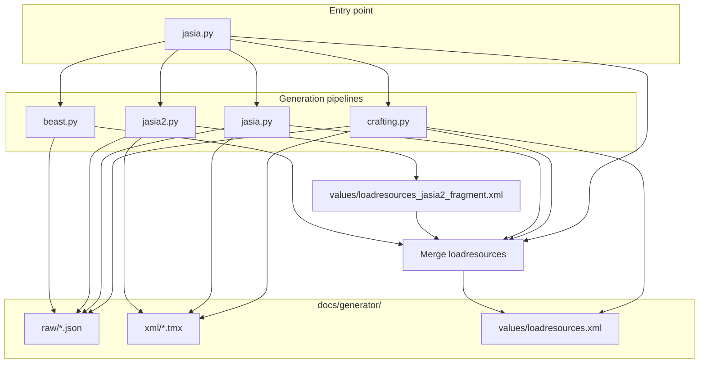

# Jasias Quest Content Generator

Python generators that produce **Andor's Trail / Jasias Quest** game data: JSON resource files, Tiled (TMX) maps, and a merged `loadresources.xml` that tells the Android app which packs to load.

The recommended entry point is **`jasia.py`**, which runs all four content pipelines in order and writes a single combined resource manifest.

---

## Table of contents

1. [Architecture](#architecture)
2. [Requirements](#requirements)
3. [Quick start](#quick-start)
4. [Directory layout](#directory-layout)
5. [Orchestrator: `jasia.py`](#orchestrator-jasiapy)
6. [Pipeline 1: `crafting.py`](#pipeline-1-craftingpy)
7. [Pipeline 2: `jasia.py`](#pipeline-2-jasiapy)
8. [Pipeline 3: `jasia2.py`](#pipeline-3-jasia2py)
9. [Pipeline 4: `beast.py`](#pipeline-4-beastpy)
10. [Output file naming](#output-file-naming)
11. [Dialogue and JSON formats](#dialogue-and-json-formats)
12. [TMX maps](#tmx-maps)
13. [Installing generated content in the game](#installing-generated-content-in-the-game)
14. [How to modify content (recipes)](#how-to-modify-content-recipes)
15. [Running generators individually](#running-generators-individually)
16. [Troubleshooting](#troubleshooting)
17. [Legacy and alternate scripts](#legacy-and-alternate-scripts)

---

## Architecture



| Script | Role |
|--------|------|
| **`jasia.py`** | Runs all pipelines; merges `loadresources.xml` |
| **`crafting.py`** | Guilds, crafting stations, overworld regions (forage/mine), shops |
| **`jasia1.py`** | Castle grid, Sunny quest, drow/dragon, holidays, haunted dungeons, wizard towers |
| **`jasia2.py`** | 22 playable factions, faction NPC dialogues, pickpocket/jail |
| **`beast.py`** | Astral beasts, breeding, regional trainers, professor/league quests |

Older standalone scripts (`castle.py`, `faction.py`) still exist but are superseded by `jasia1.py` / `jasia2.py`.

---

## Requirements

- **Python 3.10+** (3.9 may work; type hints use `dict[str, …]` in `jasia.py`)
- **Network** on first run (downloads `template.tmx` from the official Andor's Trail repo if missing)
- Optional: **[Tiled Map Editor](https://www.mapeditor.org/)** or **ATCS** to hand-edit generated TMX files

All generators assume they are run from **`docs/generator/`** (or via `jasia.py`, which `chdir`s there automatically).

---

## Quick start

```bash
cd docs/generator
python3 jasia.py
```

Typical output after a full run:

- **~340+** JSON files in `raw/`
- **~550+** TMX maps in `xml/`
- **`values/loadresources.xml`** — merged manifest for the game

Copy generated assets into the Android project (see [Installing generated content](#installing-generated-content-in-the-game)).

---

## Directory layout

```
docs/generator/
├── jasia.py              # ← run this for everything
├── crafting.py
├── jasia1.py
├── jasia2.py
├── beast.py
├── template.tmx           # Base map (auto-downloaded)
├── template_faction.tmx   # Faction hall layout
├── template_guild.tmx
├── template_home.tmx
├── template_beast_*.tmx
├── raw/                   # Generated JSON (itemlist_*, monsterlist_*, …)
├── xml/                   # Generated TMX maps
└── values/
    ├── loadresources.xml           # Final merged manifest (jasia)
    └── loadresources_jasia2_fragment.xml  # Faction-only entries (intermediate)
```

Do not commit multi‑hundred‑MB generated trees unless your project policy requires it; regenerate with `jasia.py` instead.

---

## Orchestrator: `jasia.py`

`jasia.py` is a thin coordinator. It does **not** duplicate game logic; it:

1. Sets `jasia_ORCHESTRATE=1` so child scripts avoid overwriting each other’s `loadresources.xml`.
2. Runs each pipeline with `runpy.run_path(...)`.
3. Accumulates resource lists and writes one **`values/loadresources.xml`**.

### Run order

| Step | Script | Captures into merge |
|------|--------|---------------------|
| 1 | `crafting.py` | Reads written `loadresources.xml` |
| 2 | `jasia1.py` | Parses `LOADRESOURCES_XML` constant in source |
| 3 | `jasia2.py` | Reads `loadresources_jasia2_fragment.xml` |
| 4 | `beast.py` | Parses `LOADRESOURCES_XML` constant in source |

### Merge rules

- Duplicate `<item>@raw/…</item>` lines are removed (first occurrence wins).
- `.json` suffixes on resource IDs are stripped (`conversationlist_beast.json` → `conversationlist_beast`).
- Malformed closers like `@raw/questlist_foo/item>` are fixed.

### Environment flag

| Variable | Effect |
|----------|--------|
| `jasia_ORCHESTRATE=1` | Set automatically by `jasia.py` |

| Script | When flag is set |
|--------|------------------|
| `jasia1.py` | Skips writing `loadresources.xml` |
| `jasia2.py` | Skips running `crafting.py`; writes fragment XML only |
| `beast.py` | Skips writing `loadresources.xml` |

---

## Pipeline 1: `crafting.py`

**Purpose:** Core progression systems — six guilds, crafting recipes, biome overworld templates, shops, and material/item catalogs.

### Major data structures

| Symbol | Location (~line) | Meaning |
|--------|------------------|---------|
| `REGIONS` | ~232 | Per-biome `animals` and `forage` name lists |
| `ALL_REGION_NAMES` | ~982 | 23 biome keys (`grassland`, `swamp`, `city`, …) |
| `GUILDS` | ~2172 | `adventurer`, `fighter`, `thief`, `mage`, `cleric`, `druid` |
| `auto_droplist()` | ~83 | Keyword-based animal drop item names |
| `CONVERSATIONS[…]` | various | Per-station recipe dialogues (forge, cauldron, …) |

### What it generates

- **Guild maps:** `xml/guild_<guild>.tmx` with grandmaster, leader, scholar, shop NPCs
- **Region templates:** `xml/template_<region>.tmx` with spawn areas for animals, forage keys, mining, gardening
- **JSON:** `itemlist_*`, `monsterlist_*`, `conversationlist_*`, `questlist_*`, `droplists_*`, `actorconditions_*`, `itemcategories_*`
- **`values/loadresources.xml`** when run alone

### Guild thief ranks

`actorconditions_thief.json` defines `thief_level_1` … `thief_level_12`, used by faction pickpocket in `jasia2.py`.

---

## Pipeline 2: `jasia1.py`

**Purpose:** Story and world-scale content — castle, Search for Sunny, drow lairs, dragons, seasonal holidays, horror dungeons, and multi-floor wizard towers.

### Major constants

| Symbol | Meaning |
|--------|---------|
| `CASTLE_MAIN_GRID`, `CASTLE_UPPER_GRID`, `CASTLE_LOWER_GRID` | 5×3 castle room graph |
| `DROW_RACES` | 8 drow variants (base, shadow, light, …) |
| `HAUNTED_LOCATIONS` | 7 horror dungeon prefixes |
| `HOLIDAYS` | Themed item name pools per real-world holiday |
| `TOWER_BOSS_LEVEL` | Boss floor index (6) for tower spirals |
| `MOON_COLORS` | 7 moon realm maps |

### Map generation pattern

`build_map_tmx(map_id, links, spawns, keys)` (from `template.tmx`):

- **Mapchanges** on map edges (`north` / `south` / `east` / `west`)
- **Spawn** objects: `spawngroup` = monster id, optional `phrase` = conversation id
- **Key** areas: block until quest/item requirements met

Helper grids (`spiral_box_links`, `haunted_spawns`, `tower_spawns`) connect hundreds of maps consistently.

### Key output files

- `conversationlist_castle.json`, `conversationlist_sunny.json`, `conversationlist_town.json`
- `conversationlist_holiday.json`, `conversationlist_horror.json`, `conversationlist_tower.json`
- `itemlist_drow_*`, `monsterlist_drow_*`, `itemlist_dragon.json`, …
- Hundreds of `castle_*.tmx`, `drow_*.tmx`, `tower_*.tmx`, `haunted_*.tmx`, `moon_*.tmx`, etc.

### Dialogue helpers

```python
def conv(cid, message, replies=None, rewards=None):
    # Appends to global CONVERSATIONS list

def mapchange_reward(target_map, place):
    return {"rewardType": "mapchange", "rewardID": place, "mapName": target_map}
```

---

## Pipeline 3: `jasia2.py`

**Purpose:** Faction warfare content — 22 races, gear, grandmaster sigil quests, NPC combat dialogues, thief pickpocket, and jail.

### Faction list

Edit **`FACTIONS`** (~line 396) to add/remove races:

```python
FACTIONS = [
    "human", "half_elf", "elf", …, "halfling"
]
```

Each faction gets:

| Output | Description |
|--------|-------------|
| `itemlist_faction_<race>.json` | 12 weapons, 16 armors, 15 misc items, grandmaster gear, sigil token |
| `monsterlist_faction_<race>.json` | 20 combat NPCs + weaponer, armorer, shopkeeper, leader, grandmaster |
| `conversationlist_faction_<race>.json` | Shops, leader quest, 20 NPC menus, pickpocket dialogues |
| `questlist_faction_<race>.json` | Retrieve opposing grandmaster sigil |
| `droplists_faction_<race>.json` | Shared standard droplist + shop pools |
| `xml/faction_<race>.tmx` | Hall with 5 special NPC spawns |

### Grandmaster rotation

`GRANDMASTER_TARGETS` pairs each faction with an opposing faction (half-list offset) for the sigil steal quest.

### Faction NPC conversations

Every `{faction}_npc_1` … `_20` shares this menu pattern (via `build_faction_npc_menus`):

| Option | `nextPhraseID` | Notes |
|--------|----------------|-------|
| Battle | `F` | Standard Andor's Trail fight |
| Leave | `X` | End dialogue |
| Pickpocket | `conv_pp_gold_route` | Requires `thief_level_1` actor condition |
| Steal faction item | `conv_pp_item_route_<faction>` | Requires `thief_level_7` |

### Pickpocket math

Configured in **`pickpocket_gold_chance`**, **`pickpocket_gold_max`**, **`pickpocket_item_chance`**:

| Thief rank | Gold success % | Gold amount (random) | Item steal % |
|------------|----------------|----------------------|--------------|
| 1 | 40% | 1–20 | — |
| 2 | 45% | 1–30 | — |
| … | +5% / rank | +10 max gold / rank | — |
| 7 | 70% | 1–80 | 50% |
| 8 | 75% | 1–90 | 60% |
| … | … | … | +10% / rank |
| 12 | 95% | 1–130 | 100% |

Implementation uses engine **`requireType: random`** on selector replies, then `dropList` rewards with `itemID: gold` for payouts. Failure routes to **`conv_pp_caught`** → `mapchange` to **`jail`** map `entry`.

To rebalance pickpocket, edit:

```python
def pickpocket_gold_chance(level):
    return min(100, 40 + (level - 1) * 5)

def pickpocket_gold_max(level):
    return 20 + (level - 1) * 10

def pickpocket_item_chance(level):
    return min(100, 50 + (level - 7) * 10)
```

Bail cost: **`BAIL_GOLD = 100`** in jail lawyer dialogue.

### Jail

- **`xml/jail.tmx`** — guard, captain, lawyer spawns; `entry` / `exit` mapchanges
- **`conversationlist_jail.json`**, **`monsterlist_jail.json`**

### Per-faction flavor items

**`RACE_ITEMS`** dict (~line 449) — 15 misc item display names per race used in drops and item-steal pools.

---

## Pipeline 4: `beast.py`

**Purpose:** Pokémon-style astral beast content across **9 regions** with capture, breeding hybrids, evolution scholars, shops, and league progression.

### Scale constants

| Constant | Default | Effect |
|----------|---------|--------|
| `REGIONS` | 9 names (Lumia, Kranix, …) | Regional prefixes |
| `BEASTS_PER_REGION` | 90 | Standard beasts per region |
| `LEGENDARY_BEASTS_PER_REGION` | 3 | Legendary tier |
| `MYTHICAL_BEASTS_PER_REGION` | 2 | Mythical tier |

Name generation uses **`PREFIXES`**, **`CREATURES`**, and legendary/mythical variants in `create_beasts()`.

### Main functions

| Function | Output |
|----------|--------|
| `create_beasts()` | `beast_monsters`, items, droplists, trainer NPCs |
| `create_breeding_system()` | Hybrid monsters + `conversationlist_breeding_<region>` |
| `create_capture_conversations()` | Capture minigame dialogues |
| `create_evolution_conversations()` | Per-region evolution scholars |
| `create_region_shopkeepers()` | `conversationlist_shop.json` |
| `create_professor_system()` | Professor NPC + rewards |
| `create_region_leader_system()` | League leaders + `questlist_region` |

Entry point: **`main()`** at bottom (invoked by `runpy` when called from `jasia.py`).

### Beast items

Equippable “beast” items use categories in **`BEAST_ITEM_CATEGORIES`** (weapon, shield, head, … slots) with rotating icon sheets from **`BEAST_ITEM_SLOTS`**.

---

## Output file naming

Andor's Trail expects JSON under `res/raw/` with **no `.json` extension** in `loadresources.xml` references.

| Pattern | Example | Content |
|---------|---------|---------|
| `itemlist_<topic>.json` | `itemlist_faction_human.json` | Items |
| `monsterlist_<topic>.json` | `monsterlist_castle.json` | NPCs / monsters |
| `conversationlist_<topic>.json` | `conversationlist_thief.json` | Dialogues / scripts |
| `questlist_<topic>.json` | `questlist_sunny.json` | Quest definitions |
| `droplists_<topic>.json` | `droplists_pickpocket.json` | Loot tables |
| `actorconditions_<topic>.json` | `actorconditions_beast.json` | Buffs / ranks |
| `itemcategories_<topic>.json` | `itemcategories_mage.json` | Shop categories |

TMX map **filename without extension** is the map ID (e.g. `jail.tmx` → map id `jail`).

---

## Dialogue and JSON formats

Generators target the **jasias-quest / Andor's Trail** JSON schema (see repo `ContentFormatReference/`).

### Conversation entry (correct)

```json
{
    "id": "conv_human_npc_1",
    "message": "The warrior eyes you warily. What do you want?",
    "replies": [
        {
            "text": "Battle",
            "nextPhraseID": "F"
        },
        {
            "text": "Leave",
            "nextPhraseID": "X"
        }
    ]
}
```

### Special `nextPhraseID` values

| ID | Behavior |
|----|----------|
| `X` | End conversation |
| `F` | Start fight (player goes first) |
| `R` | Remove NPC without loot |
| `S` | Open shop (NPC must have droplist shop inventory) |

### Monster ↔ dialogue link

```json
{
    "id": "human_npc_1",
    "name": "Human Warrior",
    "phraseID": "conv_human_npc_1",
    "conversation": "conversationlist_faction_human",
    "droplistID": "droplist_human_standard",
    "spawnGroup": "faction",
    "faction": "human"
}
```

On maps, spawns can also set property **`phrase`** to the dialogue id.

### Droplist item keys

Use **`itemID`** (not `item`) in new content. `jasia2.py` `make_drop_item()` emits `itemID`.

### Requirements and rewards (common)

```json
"requires": [
    { "requireType": "hasActorCondition", "requireID": "thief_level_1" },
    { "requireType": "random", "requireID": "40" },
    { "requireType": "inventoryKeep", "requireID": "gold", "value": 100 },
    { "requireType": "inventoryRemove", "requireID": "gold", "value": 100 }
],
"rewards": [
    { "rewardType": "dropList", "rewardID": "droplist_pp_gold_reward_1" },
    { "rewardType": "mapchange", "rewardID": "entry", "mapName": "jail" },
    { "rewardType": "questProgress", "rewardID": "quest_human_retrieve_sigil", "value": 10 }
]
```

---

## TMX maps

### Templates

| File | Used by |
|------|---------|
| `template.tmx` | `crafting.py`, `jasia.py`, jail map in `jasia2.py` |
| `template_faction.tmx` | `faction_<race>.tmx` halls |

Download URL is embedded in scripts (`AndorsTrailRelease/andors-trail` `template.tmx`).

### Object types (in generated maps)

| `type` | Purpose |
|--------|---------|
| `spawn` | NPC/monster spawn area (`spawngroup`, optional `phrase`) |
| `mapchange` | Exit to another map (`map`, `place` properties) |
| `key` | Gated area (`phrase` = dialogue id) |
| `sign` / `script` | Trigger dialogue on enter |

### Map size

Standard templates use **30×30 tiles** at **32 px** (`TILE = 32` in `jasia.py` / `jasia2.py`).

---

## Installing generated content in the game

Typical integration with the Android project (`AndorsTrail/`):

1. Copy **`docs/generator/raw/*.json`** → `AndorsTrail/res/raw/`
2. Copy **`docs/generator/xml/*.tmx`** → `AndorsTrail/res/xml/`
3. Merge **`docs/generator/values/loadresources.xml`** into the project’s `res/values/loadresources.xml` (or replace arrays if this pack is standalone)
4. Rebuild the APK

Exact merge policy depends on your fork; never duplicate the same `@raw/itemlist_*` entry twice in one array.

---

## How to modify content (recipes)

### Add a new faction race

1. Open **`jasia2.py`**.
2. Add slug to **`FACTIONS`** (e.g. `"tiefling"`).
3. Add 15 entries to **`RACE_ITEMS["tiefling"]`**.
4. Re-run `python3 jasia.py`.
5. Wire `faction_tiefling.tmx` into your world `.world` file in Tiled (manual step).

### Add animals or forage to a biome

1. Open **`crafting.py`** → **`REGIONS["grassland"]`** (or add a new key to `ALL_REGION_NAMES`).
2. Adjust `animals` / `forage` lists; droplists auto-generate via `auto_droplist()` unless overridden later in the file.
3. Regenerate.

### Add a haunted dungeon location

1. Open **`jasia1.py`** → append to **`HAUNTED_LOCATIONS`**.
2. Extend horror monster/item generation loops that iterate `HAUNTED_LOCATIONS` (search the file for the constant).
3. Add map grid entries if you use a connection grid (follow existing `haunted_*` map naming: `<loc>_<corner>`).
4. Regenerate.

### Change pickpocket or bail rules

Edit **`jasia2.py`**:

- `BAIL_GOLD`
- `pickpocket_gold_chance`, `pickpocket_gold_max`, `pickpocket_item_chance`
- Dialogue text in `build_pickpocket_and_jail_content()` / `build_faction_npc_menus()`

Thief rank conditions must exist in **`actorconditions_thief.json`** (from `crafting.py`).

### Add a beast region

1. Open **`beast.py`** → add name to **`REGIONS`**.
2. Update **`LOADRESOURCES_XML`** string at bottom to include new `conversationlist_<region>`, breeding list, etc. (or rely on `jasia` merge from a dynamic list if you refactor beast to append like jasia2).
3. Regenerate; add TMX / world links manually.

### Add a custom conversation to one castle NPC

1. Open **`jasia1.py`** → find `conv_castle_npc_*` generation or `default_castle_spawns`.
2. Add a `conv(...)` call in the conversation build section.
3. Point spawn `phrase` at your new `conv_*` id in `default_castle_spawns`.

### Add a new guild crafting recipe

1. Open **`crafting.py`** → find the relevant `CONVERSATIONS["forge"]` (or cauldron) builder.
2. Use `_craft_entry()` pattern with ingredients and output item id.
3. Ensure output item exists in the appropriate `ITEMLISTS[...]`.

---

## Running generators individually

| Command | Writes `loadresources.xml` | Notes |
|---------|----------------------------|-------|
| `python3 jasia.py` | Merged full pack | **Recommended** |
| `python3 crafting.py` | Crafting only | Overwrites manifest |
| `python3 jasia1.py` | Jasia slice only | Overwrites manifest |
| `python3 jasia2.py` | Crafting + faction merge | Also runs `crafting.py` first |
| `python3 beast.py` | Beast only | Calls `main()` |

For partial iteration during development, run the module you changed, then run **`jasia.py`** once to refresh the merged manifest.

---

## Troubleshooting

| Problem | Likely cause | Fix |
|---------|--------------|-----|
| `template.tmx` missing / download fails | Offline or blocked network | Download manually from AndorsTrailRelease and place in `docs/generator/` |
| Duplicate resource crash in game | Same `@raw/…` listed twice in `loadresources.xml` | Re-run `jasia.py`; check merge; search duplicate `<item>` lines |
| NPC silent / instant fight | Missing `phraseID` or wrong `conversation` list | Match monster fields to an existing `conv_*` in the loaded conversationlist file |
| Pickpocket never appears | Player lacks `thief_level_1` condition | Complete thief guild trials (`crafting.py` quests) |
| Pickpocket always sends to jail | `random` requirement order in selector | Success reply must appear **before** failure reply in `conv_pp_gold_result_*` |
| Mapchange to jail fails | `jail.tmx` missing `entry` place | Regenerate; verify `xml/jail.tmx` Mapevents layer |
| Beast quests broken | Typo in `LOADRESOURCES_XML` | Fixed in source (`questlist_professor`, not `…/item>`) |

---

## Legacy and alternate scripts

| File | Status |
|------|--------|
| `jasia.py` | **Primary** full build |
| `jasia2.py` | Faction + jail; use via jasia or standalone |
| `jasia1.py` | Castle / quest / towers |
| `crafting.py` | Guilds / crafting / regions |
| `beast.py` | Astral beasts |

For format details beyond this repo, see **`ContentFormatReference/`** at the project root and the upstream [Andor's Trail Content Format Reference](https://github.com/AndorsTrailRelease/andors-trail).

---

## Summary

| Goal | Action |
|------|--------|
| Build everything | `python3 jasia.py` |
| Change factions / pickpocket / jail | Edit `jasia2.py` |
| Change castle / quests / towers | Edit `jasia1.py` |
| Change guilds / crafting / biomes | Edit `crafting.py` |
| Change beasts / breeding | Edit `beast.py` |
| Register resources in game | Use merged `values/loadresources.xml` + copy `raw/` and `xml/` |

The generators are procedural: most edits are **constants and tables** at the top of each file plus **helper functions** that emit JSON/TMX. Regenerate after every change; diff `raw/` and `xml/` in version control to review impact.
